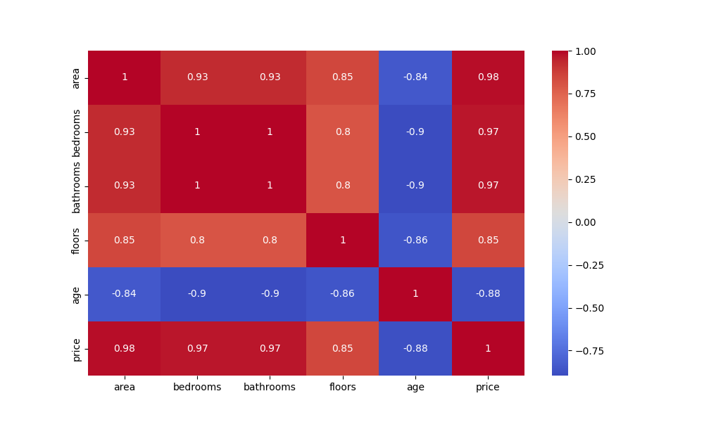
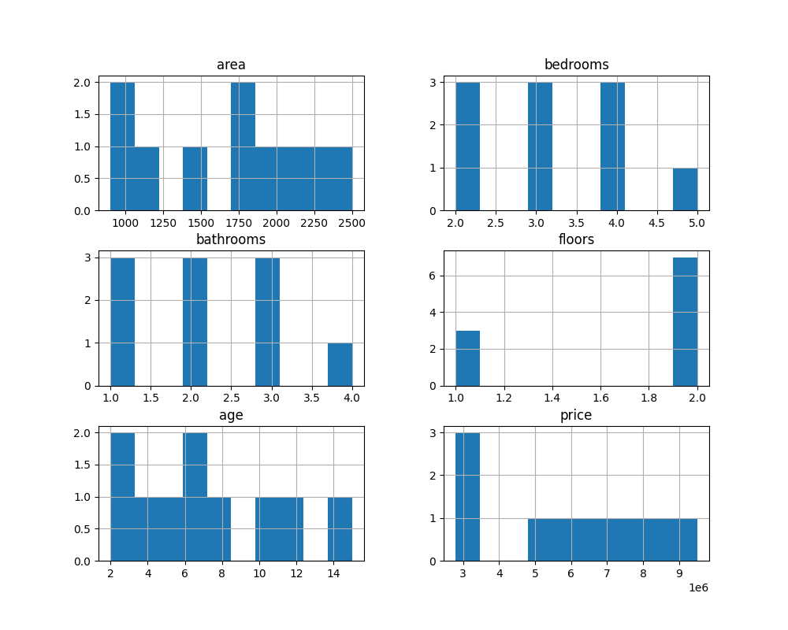
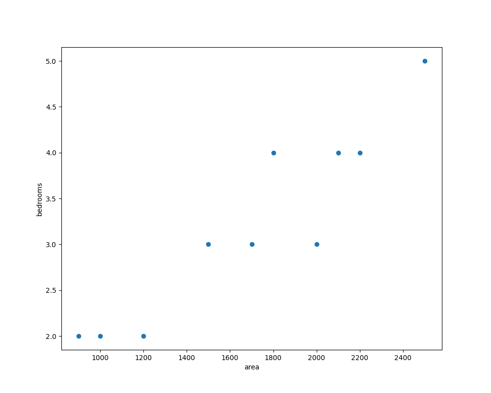

# 🏠 House Price Prediction

## 📌 Project Overview
This project predicts house prices using Machine Learning techniques. It includes data preprocessing, visualization, and model building.

---

## ⚙️ Technologies Used
- Python
- Pandas
- NumPy
- Matplotlib
- Seaborn
- Scikit-learn

---

## 📊 Project Workflow
1. Data Collection
2. Data Cleaning
3. Exploratory Data Analysis (EDA)
4. Data Visualization
5. Model Building

---

## 📸 Output Screenshots

### 🔹 Heatmap


### 🔹 Histogram


### 🔹 Scatter Plot


---

## 🚀 How to Run
```bash
python main.py